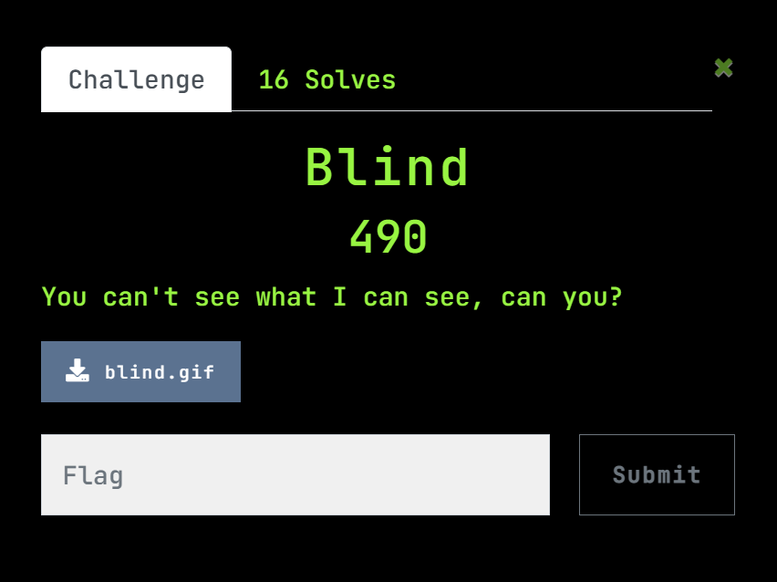
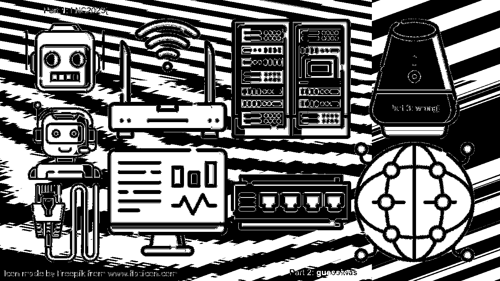

# Lag and Crash 3.0/Forensics/Blind
### 490 pts, 16 solves, No difficulty rating

## Description



Attachement:<br/>
[blind.gif](assets/blind.gif)<br/>

## Indentifying the filetype
Opening the file, we are greeted with an error that it is corrupted. In any CTFs this likely means that the file header was changed. <br/>
Let's analyse the image in a hex dump.<br/>
Notice the first few bytes:
```hexdump
47 49 46 38 37 61 1a 0a 00 00 00 0d 49 48 44 52  |GIF87a......IHDR|
```

`IHDR` is the first chunk in a PNG image, and it includes all of the details about the type of the image <br/>
<br/>

Notice the last few bytes as well:
```hexdump
ff 9a ab a5 39 00 00 00 00 49 45 4e 44 ae 42 60  |ÿ.«¥9....IEND®B`|
82                                               |.|
```

The `IEND` chunk is also typically used to mark the end of the PNG datastream too.<br/>

Both these factors give us strong intuition that the original file is likely to be a PNG file.

## Fixing the file
Looking up the [list of file signatures off wikipedia](https://en.wikipedia.org/wiki/List_of_file_signatures), we find that a Png file should start with `89 50 4E 47 0D 0A 1A 0A` <br/>
Thus, by replacing the first 8 bytes, we get the [fixed image](assests/fixed.png).


Viola, part 1 and 3 of the flag can clearly be seen.

`LNC2023{???wrong}`

We are on the right track

## Last part of the flag
After runnng strings and binwalk on the file and getting nowhere, I threw the file into [aperisolve](https://www.aperisolve.com/)

Taking a careful look at the outputs, we can find the second part of the flag.

However, as of writing, Aperisolve is down. Instead, you could run [stegsolve](https://wiki.bi0s.in/steganography/stegsolve/) to get the same results.

This [exact image](assets/part2.png) was under Blue Plane 2. However, many other settings make part 2 visible too.


<br/><br/>

> LNC2023{guessiwaswrong}

<br/>
Writeup by Team RVCTF 0x45