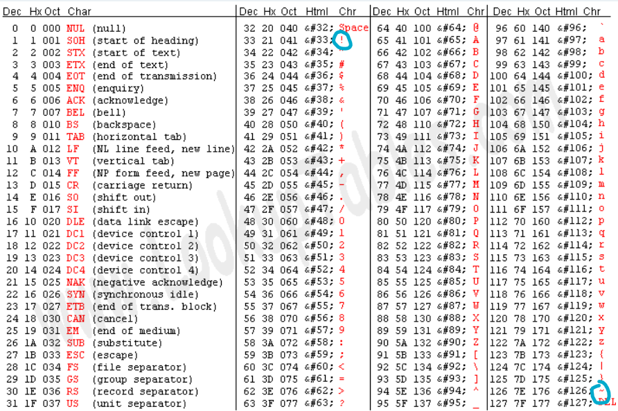

# Lag and Crash 3.0/Mobile/The EcoSystem
### 500 pts, 5 solves, Hard difficulty

## Disclaimer

Before you read this writeup it is important that I mention two things: <br/>
1. I did not solve this during the competition itself
2. I am still not sure of the prgram flow

<sup><sub><sup><sub>However, the potential of getting a Starbucks giftcard is too great for me to pass on.</sub></sup></sub></sup>


## Description


Ciphertext: BW8Ifwk/CX8JXwZfCT8IbwlfC28Hfw1fCF8Kfwk/Bk8JXwRPCT8HTwlfBU8GXwtPDU8ETwxvCm8OXwp/Bl8Gbw5PCn8Dbwd/CV8Kfw1fCT8NTwRPAl8Gbw5fDW8KTwVPDU8FTwZfBm8PTwdPCk8GTw9PB18KTwRPBF8Hbw0/DT8=

Attachements:<br/>
[TheEcoSystem.zip](assets/TheEcoSystem.zip)<br/>
([unzipped version](assets/TheEcoSystem) also in assets)

<details>
  <summary>Hint 1:</summary>
  Focus on the Objective-C and Assembly files.
</details>
<details>
  <summary>Hint 2:</summary>
  MacOS enc.m --> MacOS math.s --> iOS enc.m --> iOS magic.s
</details>
<details>
  <summary>Hint 3:</summary>
  Better brush up on Swift, Objective-C and ARM64 Assembly ;)
</details>

## Program flow
<sup><sub><sup><sub>This challenge would not exist if Apple weren't so buggy /j</sub></sup></sub></sup>

From the [README.md](assets/TheEcoSystem/TheEcoSystem/README.md), we learn that TheEcoSystem is an implementation of user handoff in IOS (this is what enables you to listen to music on your phone and continue on your laptop).

The relevant file structure looks as such:

```
.
├── ...
├── TheEcoSystem
│   ├── ...                  
│   ├── enc.m             
│   ├── math.s            
│   ├── RootViewController.swift          
│   └── ...
├── TheEcoSystemIOS
│   ├── ...                  
│   │   ├── ...
│   │   ├── enc.m
│   │   ├── magic.s
│   │   ├── ...          
│   ├── RootViewController.swift          
│   └── ...                    
└── ...
```

As with most Apple implementation, it is useful to look at the RootViewController to see what the program is doing.

However, this is the part I am unsure about. Initially I thought that the program would enter via the phone first, then go to the MAC as the challenge description stated that the encryption occured `When I came back and handed the note back to my Macbook` from their Iphone. I was wrong.

The way I figured out the program flow was only after reversing a few functions. But, let's not delve into that. For now, you can try to figure it out yourself, or just take my word for it (or read Hint 2).

The program starts off at the [MACOS RootViewController](assets/TheEcoSystem/TheEcoSystem/TheEcoSystem/TheEcoSystem/RootViewController.swift)

```swift
/*
See LICENSE folder for this sample’s licensing information.

Abstract:
A view controller that manages a map and the user's activity within it, creating and receiving NSUserActivity objects for Handoff.
*/

import AppKit
import SwiftUI
import Combine

class RootViewController: NSViewController, ObservableObject {
    
    private lazy var editingActivity: NSUserActivity = {
        let activity = NSUserActivity.initEditingActivity()
        activity.delegate = self
        return activity
    }()
    
    @Published var text = "Type here..."
    @Published var enc = ""
    private var anyCancellable = Set<AnyCancellable>()
    
    override func viewDidLoad() {
        super.viewDidLoad()
        
        Publishers.CombineLatest($text, $enc)
            .sink { [weak self] (a, b) in
                guard let self = self,
                      let activity = self.userActivity else { return }
                
                let encoder = SuperSecureEncryptionMechanism()
                let enc = encoder.encrypt(b == "" ? a : b, activity)
                activity.updateEditingActivity(a, enc)
            }.store(in: &anyCancellable)
        
    }
    
    override func viewDidAppear() {
        super.viewDidAppear()
        editingActivity.needsSave = true
        editingActivity.isEligibleForHandoff = true
        editingActivity.becomeCurrent()
        userActivity = editingActivity
        
        // Add SwiftUI View to RootViewController
        let controller = NSHostingController(rootView: ContentView(viewController: self))
        
        addChild(controller)
        controller.view.translatesAutoresizingMaskIntoConstraints = false
        view.addSubview(controller.view)
        NSLayoutConstraint.activate([
            controller.view.widthAnchor.constraint(equalTo: view.widthAnchor),
            controller.view.heightAnchor.constraint(equalTo: view.heightAnchor),
            controller.view.centerXAnchor.constraint(equalTo: view.centerXAnchor),
            controller.view.centerYAnchor.constraint(equalTo: view.centerYAnchor)
        ])
    }
    
    // MARK: - Handoff support
    override func updateUserActivityState(_ activity: NSUserActivity) {
        
        let encoder = SuperSecureEncryptionMechanism()
        let enc = encoder.encrypt(text, activity)
        
        activity.updateEditingActivity(text, enc)
    }
    
    override func restoreUserActivityState(_ userActivity: NSUserActivity) {
        super.restoreUserActivityState(userActivity)
        
        switch userActivity.activityType {
            case NSUserActivity.editingActivityType:
                guard let userInfo = userActivity.getUserInfo() else {
                    return
                }
                
                text = userInfo.text
                enc = userInfo.enc
                
            default:
                break
        }
    }
    
}

// MARK: - NSUserActivityDelegate
extension RootViewController: NSUserActivityDelegate {
    
    func userActivityWasContinued(_ userActivity: NSUserActivity) {
        DispatchQueue.main.async {
            self.enc = "Continued on another device..."
        }
    }
}
```

The only thing out of place here is the `SuperSecureEncryptionMechanism()`.

After snooping around a little, we find that `SuperSecureEncryptionMechanism()` is implemented under [enc.m](assets/TheEcoSystem/TheEcoSystem/TheEcoSystem/TheEcoSystem/enc.m)

```smalltalk
#import <Foundation/Foundation.h>
#import "enc.h"
#import "math.h"

@implementation SuperSecureEncryptionMechanism

- (NSString*)encrypt:(NSString*)input
                    :(NSUserActivity*)activity {
    
    NSString *bundleIdentifier = [[NSBundle mainBundle] bundleIdentifier];
    
    const char *inputPointer = [input UTF8String];
    char finalString[65535] = "";
    math(inputPointer, finalString);
    
    NSString *finalStringBefore = [NSString stringWithCString:finalString encoding:NSASCIIStringEncoding];
    NSData *plainData = [finalStringBefore dataUsingEncoding:NSUTF8StringEncoding];
    NSString *encodedString = [plainData base64EncodedStringWithOptions:0];
    
    [activity setUserInfo: @{@"enc": encodedString, @"setby": bundleIdentifier, @"text": input}];
    
    return encodedString;
    
}

@end
```

<sup><sub><sup><sub>(github has almost no formatting for objective-c, so this is formatted in smalltalk)</sup></sub></sup></sub>

We see that the program calls

```smalltalk
math(inputPointer, finalString);
```

then 

```smalltalk
NSString *encodedString = [plainData base64EncodedStringWithOptions:0];
```

which encodes `finalString` in base64 and returns it.

Afterwhich, this string will be handed-off to the IOS (or calls the IOS functions, I'm not sure)

The [IOS RootViewController](assets/TheEcoSystem/TheEcoSystem/TheEcoSystem/TheEcoSystemIOS/RootViewController.swift) looks almost identical to the MACOS one, with `SuperSecureEncryptionMechanism()` standing out.

Let's take a look at the `SuperSecureEncryptionMechanism()` which is implemented in [enc.m](assets/TheEcoSystem/TheEcoSystem/TheEcoSystem/TheEcoSystemIOS/logic/enc.m)

```smalltalk
@implementation SuperSecureEncryptionMechanismIOS

- (NSString*)encrypt:(NSString*)input
                    :(NSUserActivity*)activity {
    
    NSString *bundleIdentifier = [[NSBundle mainBundle] bundleIdentifier];
    
    NSString *newString = [[input stringByReplacingOccurrencesOfString: @"0" withString:@"\x5D"] stringByReplacingOccurrencesOfString:@"P" withString:@"\x5E"];
    NSMutableString *final = [NSMutableString stringWithString:@""];
    
    for (int i = 0; i < [newString length]; i++) {
        NSString *character = [NSString stringWithFormat:@"%C", [newString characterAtIndex: i]];
        const char *charPointer = [character UTF8String];
        char charBuff[4] = "";
        magic(charPointer, charBuff);
        NSString *charString = [NSString stringWithCString:charBuff encoding:NSASCIIStringEncoding];
        [final appendString: charString];
    }
    
    NSData *plainData = [final dataUsingEncoding:NSUTF8StringEncoding];
    NSString *encodedString = [plainData base64EncodedStringWithOptions:0];
    
    [activity setUserInfo: @{@"enc": encodedString, @"setby": bundleIdentifier, @"text": input}];
    
    return encodedString;
    
}
```

The program firsts does this:

```smalltalk
NSString *newString = [[input stringByReplacingOccurrencesOfString: @"0" withString:@"\x5D"] stringByReplacingOccurrencesOfString:@"P" withString:@"\x5E"];
```

which replaces all occurances of '0' with '\x5D', and all occurances of 'P' with '\x5E'.

Afterwhich, the program calls

```smalltalk
for (int i = 0; i < [newString length]; i++) {
    ...
    magic(charPointer, charBuff);
    ...
}
```

before finally encoding it in base64 again:

```smalltalk
NSString *encodedString = [plainData base64EncodedStringWithOptions:0];
```

So, to recap, the program flow is as such:

1. calls math()
2. Encodes it in Base64
3. Replaces certain charaters
4. calls magic() for each charater
5. Encodes it in Base64

So, to find obtain the original plaintext, all we have to do is the reverse:

1. Decode the ciphertext from base64
2. Reverse magic()
3. Replaces defined charaters
4. Decode it from base64
5. Reverse math()

## Step 1 and 2:

Decoding the cipher text from base64 is rather simple.
A simple script does the trick

```py
import base64
cipher = "BW8Ifwk/CX8JXwZfCT8IbwlfC28Hfw1fCF8Kfwk/Bk8JXwRPCT8HTwlfBU8GXwtPDU8ETwxvCm8OXwp/Bl8Gbw5PCn8Dbwd/CV8Kfw1fCT8NTwRPAl8Gbw5fDW8KTwVPDU8FTwZfBm8PTwdPCk8GTw9PB18KTwRPBF8Hbw0/DT8="
cipher = base64.b64decode(cipher)
```


> b'\x05o\x08\x7f\t?\t\x7f\t_\x06_\t?\x08o\t_\x0bo\x07\x7f\r_\x08_\n\x7f\t?\x06O\t_\x04O\t?\x07O\t_\x05O\x06_\x0bO\rO\x04O\x0co\no\x0e_\n\x7f\x06_\x06o\x0eO\n\x7f\x03o\x07\x7f\t_\n\x7f\r_\t?\rO\x04O\x02_\x06o\x0e_\ro\nO\x05O\rO\x05O\x06_\x06o\x0fO\x07O\nO\x06O\x0fO\x07_\nO\x04O\x04_\x07o\r?\r?'

Next, let's take a look at what [magic](assets/TheEcoSystem/TheEcoSystem/TheEcoSystem/TheEcoSystemIOS/logic/magic.s) (found under magic.s) does.

> **Note**
>
> Recall that `magic()` is called with two parameters: `magic(charPointer, charBuff)`;
> In ARM64 architecture, the first parameter (charPointer) is usually assigned to X0, the second to X1 and so on


```assembly
_magic: MOV    X4, X1

loop:
    LDRB    W5, [X0], #1

    MOV     W6, #240
    LSR     W6, W6, 4

    AND     W4, W5, W6
    ORR     W3, W5, W6
    
cont:
    STRB    W4, [X1], #1    // store character to output str
    STRB    W3, [X1], #1    // store character to output str
    CMP     W5, #0x00       // stop on hitting a null character
    B.NE    loop            // loop if character isn't null
    SUB     X0, X1, X4      // get the length by subtracting the pointers
    RET                     // Return to caller
```

The program is written in ARM64. [Here is the documentation for those who needs it.](https://developer.arm.com/documentation/102374/latest/)

Here is an annotated version of the program, according to my understanding:

```assembly
// note in ARM64 architecture, 
_magic: MOV    X4, X1

loop:
    LDRB    W5, [X0], #1 // Reads the address at X0, stores it into W5, then adds one to the address (X0) i.e. just looping

    MOV     W6, #240 // assigns the W6 the value 240 (0xF0 in hex)
    LSR     W6, W6, 4 // (logical shift right) right bit shifts 240 by 4 i.e. W6 becomes 15 (0x0F in hex)

    AND     W4, W5, W6 // performs AND on W5 and W6, stores in W4
    ORR     W3, W5, W6 // performs or on W5 and W6, stores in W3
    
cont:
    STRB    W4, [X1], #1    // store character to output str
    STRB    W3, [X1], #1    // store character to output str
    CMP     W5, #0x00       // stop on hitting a null character
    B.NE    loop            // loop if character isn't null
    SUB     X0, X1, X4      // get the length by subtracting the pointers
    RET                     // Return to caller
```

From this, we can tell that the program will do the following for each charater in the text (recall that enc.m calls magic for every character):

* Perform a bitwise AND operation on the charater and 0x0F
  * Add it to the output string
* Perform a bitwise AND operation on the charater and 0x0F

Did you notice an interesting property of the number 15, what does this tell us? <br/>
Since bitwise operations are being used, let's view 15 in binary instead. <br/>

<table>
<tr>
<td>0</td>
<td>0</td>
<td>0</td>
<td>0</td>
<td>1</td>
<td>1</td>
<td>1</td>
<td>1</td>
<td>1</td>
</tr>
</table>

Notice that the first 4 bits are all `0`s while the last four bits are all `1`s. 

What does this mean in terms of bitwise operations? First let's understand what AND and OR does.

<table>
<td width = "50%">
<table>
<tr>
<td width = "25%">0</td>
<td width = "25%">0</td>
<td width = "25%">1</td>
<td width = "25%">1</td>
</tr>
<tr>
<th>
AND
</th>
</tr>
<tr>
<td width = "25%">1</td>
<td width = "25%">0</td>
<td width = "25%">1</td>
<td width = "25%">0</td>
</tr>
<tr>
<th>
Result:
</th>
</tr>
<tr>
<td width = "25%">0</td>
<td width = "25%">0</td>
<td width = "25%">1</td>
<td width = "25%">0</td>
</tr>
</table>
</td>

<td width = "50%">
<table>
<tr>
<td width = "25%">0</td>
<td width = "25%">0</td>
<td width = "25%">1</td>
<td width = "25%">1</td>
</tr>
<tr>
<th>
OR
</th>
</tr>
<tr>
<td width = "25%">1</td>
<td width = "25%">0</td>
<td width = "25%">1</td>
<td width = "25%">0</td>
</tr>
<tr>
<th>
Result:
</th>
</tr>
<tr>
<td width = "25%">1</td>
<td width = "25%">0</td>
<td width = "25%">1</td>
<td width = "25%">1</td>
</tr>
</table>
</td>
</table>

For AND operations, both bits need to be `1` for it to output `1`, otherwise it outputs `0`. Whereas for OR operations, only one bit needs to be `1` for it to output `1` (i.e. both bits need to be `0` for it to output `0`).

Since 15 is `00001111`, when the AND operation is performed on a charater, the first 4 bits would be `0000`, while the last 4 bits would match the last 4 bits of the character (as only if that bit is `1` would the output be `1`.)

The inverse can be said for the OR operation. The last 4 bits would be `1111`, while the first 4 would match that of the charater.

We can observe this when we convert the base64 decoded string into binary:

`00000101 01101111 00001000 01111111 00001001 00111111 00001001 01111111 00001001 01011111 00000110 01011111 00001001 00111111 00001000 01101111 00001001 01011111 00001011 01101111 00000111 01111111 00001101 01011111 00001000 01011111 00001010 01111111 00001001 00111111 00000110 01001111 00001001 01011111 00000100 01001111 00001001 00111111 00000111 01001111 00001001 01011111 00000101 01001111 00000110 01011111 00001011 01001111 00001101 01001111 00000100 01001111 00001100 01101111 00001010 01101111 00001110 01011111 00001010 01111111 00000110 01011111 00000110 01101111 00001110 01001111 00001010 01111111 00000011 01101111 00000111 01111111 00001001 01011111 00001010 01111111 00001101 01011111 00001001 00111111 00001101 01001111 00000100 01001111 00000010 01011111 00000110 01101111 00001110 01011111 00001101 01101111 00001010 01001111 00000101 01001111 00001101 01001111 00000101 01001111 00000110 01011111 00000110 01101111 00001111 01001111 00000111 01001111 00001010 01001111 00000110 01001111 00001111 01001111 00000111 01011111 00001010 01001111 00000100 01001111 00000100 01011111 00000111 01101111 00001101 00111111 00001101 00111111`

Therefore, as the program would output the charater AND 15, then the charater OR 15, we simply loop through the string, take the first 4 bits from the OR operated output, and the last 4 bits of the AND operated output to get the original input.

Here is a python script for that:

```py
cipher = ["{:08b}".format(i) for i in cipher] # converts to binary

decoded1 = []
for i in range(0, len(cipher), 2):
    # cipher[i]: AND operated output
    # cipher[i + 1]: OR operated output
    decoded1.append(cipher[i + 1][:4] + cipher[i][4:]) # take first 4 from OR, last 4 from AND, and combine
```

>['01100101', '01111000', '00111001', '01111001', '01011001', '01010110', '00111001', '01101000', '01011001', '01101011', '01110111', '01011101', '01011000', '01111010', '00111001', '01000110', '01011001', '01000100', '00111001', '01000111', '01011001', '01000101', '01010110', '01001011', '01001101', '01000100', '01101100', '01101010', '01011110', '01111010', '01010110', '01100110', '01001110', '01111010', '01100011', '01110111', '01011001', '01111010', '01011101', '00111001', '01001101', '01000100', '01010010', '01100110', '01011110', '01101101', '01001010', '01000101', '01001101', '01000101', '01010110', '01100110', '01001111', '01000111', '01001010', '01000110', '01001111', '01010111', '01001010', '01000100', '01010100', '01100111', '00111101', '00111101']


## Steps 3, 4 & 5
3. Replaces defined charaters
4. Decode it from base64
5. Reverse math()

for step 3, recall the program replaces all occurances of '0' with '\x5D', and all occurances of 'P' with '\x5E'

We can simply do the reverse and then base64 decode it. But before that, let's convert our binary output to its string representation:

```py
decoded1 = "".join([chr(int(i, 2)) for i in decoded1]) # convert from binary to string representation

decoded1 = decoded1.replace("\x5D", "0").replace("\x5E", "P")
# note \x5D is actually ']' and \x5E is '^' in hex

decoded1 = base64.b64decode(decoded1)
```

> ex9yYV9hYkw0Xz9FYD9GYEVKMDljPzVfNzcwYz09MDRfPmJEMEVfOGJFOWJDTg==

We are left with the final step. Let's take a look at what Next, let's take a look at what [math()](assets/TheEcoSystem/TheEcoSystem/TheEcoSystem/TheEcoSystem/math.s) (found under math.s) does:

> **Note**
>
> Recall that `math()` is called with two parameters: `magic(inputPointer, finalString)`
> Also the following is a self-annotated version

```assembly
_math: MOV    X4, X1

loop:
    LDRB    W5, [X0], #1 // Reads the address at X0, stores it into W5, then adds one to the address (X0) i.e. just looping

    CMP     W5, #'!' // Compares W5 to '!'
    B.LT    cont // goes to Cont: if W5 is less than '!'

    CMP     W5, #'~' // Compares W5 to '~'
    B.GT    cont // goes to Cont: if W5 is Greater than '~'

    CMP     W5, #78 // Comapares W5 to 78
    B.LT    smaller // goes to smaller: if W5 is less than 78
    B.GE    bigger // goes to bigger: if W5 is greater than or equal to 78

    B       cont // goes to cont:

smaller: // if W5 is less than 78
    ADD     W6, W5, #47 // adds 47 to W5 and stores in W6
    MOV     W5, W6 // Stores value at W6 in W5
    B       cont // goes to cont:

bigger: // if W5 is greater than or equal to 78
    SUB     W6, W5, #47 // subtracts 47 from W5 and stores in W6
    MOV     W5, W6 // Stores value at W6 in W5
    B       cont // goes to cont:
    
cont:
    STRB    W5, [X1], #1    // store character to output str
    CMP     W5, #0          // stop on hitting a null character
    B.NE    loop            // loop if character isn't null
    SUB     X0, X1, X4      // get the length by subtracting the pointers
    RET                     // Return to caller
```

This:
```Assembly
    CMP     W5, #'!' // Compares W5 to '!'
    B.LT    cont // goes to Cont: if W5 is less than '!'

    CMP     W5, #'~' // Compares W5 to '~'
    B.GT    cont // goes to Cont: if W5 is Greater than '~'
```
basically checks whether the character is < ord('!') or > ord('~'). If they are, these charaters are skipped. We can basically ignore these, as when we look at the ascii table, we note that no charaters exist before '!' and after '~'.



The next part of the program checks if the value is smaller than 78:

* If it is, add 47 to it
* Else, subtract 47 from it.

Referring back to the ascii table, this gives us a range of values for each condition:

* Value now ranges from 78 - 47 to 126 - 47 = 31 to 79 if originally larger than 78
* Value now ranges from 33 + 47 to 77 + 47 = 80 to 124 if originally smaller than 78

To reverse this, we can simply subtract 78 if the character is from 80 to 124 and add 78 if the character is from 31 to 79.

```py
decoded2 = ""
for i in decoded1:
    if i >= 80 and i <= 124:
        decoded2 += chr(i - 47)
    elif i >= 31 and i <= 79:
        decoded2 += chr(i + 47)
```

## [Full solve script](assets/solu.py)
```py
"""Math --> base64 --> replace --> magic --> b64"""

import base64
cipher = "BW8Ifwk/CX8JXwZfCT8IbwlfC28Hfw1fCF8Kfwk/Bk8JXwRPCT8HTwlfBU8GXwtPDU8ETwxvCm8OXwp/Bl8Gbw5PCn8Dbwd/CV8Kfw1fCT8NTwRPAl8Gbw5fDW8KTwVPDU8FTwZfBm8PTwdPCk8GTw9PB18KTwRPBF8Hbw0/DT8="
cipher = base64.b64decode(cipher)
print(cipher)

cipher = ["{:08b}".format(i) for i in cipher] # converts to binary

decoded1 = []
for i in range(0, len(cipher), 2):
    # cipher[i]: AND operated output
    # cipher[i + 1]: OR operated output
    decoded1.append(cipher[i + 1][:4] + cipher[i][4:]) # take first 4 from OR, last 4 from AND, and combine
print(decoded1)

decoded1 = "".join([chr(int(i, 2)) for i in decoded1]) # convert from binary to string representation
print(decoded1)

decoded1 = decoded1.replace("\x5D", "0").replace("\x5E", "P")
# note \x5D is actually ']' and \x5E is '^' in hex
print(decoded1)

decoded1 = base64.b64decode(decoded1)
print(decoded1)

print(len(decoded1))
decoded2 = ""
for i in decoded1:
    if i >= 80 and i <= 124:
        decoded2 += chr(i - 47)
    elif i >= 31 and i <= 79:
        decoded2 += chr(i + 47)

print(decoded2)
```
>LNC2023{c0nt1nu1ty_h4nd0ff_4ll_c0m3s_t0g3th3r}

<br/>
Writeup by Team RVCTF 0x45