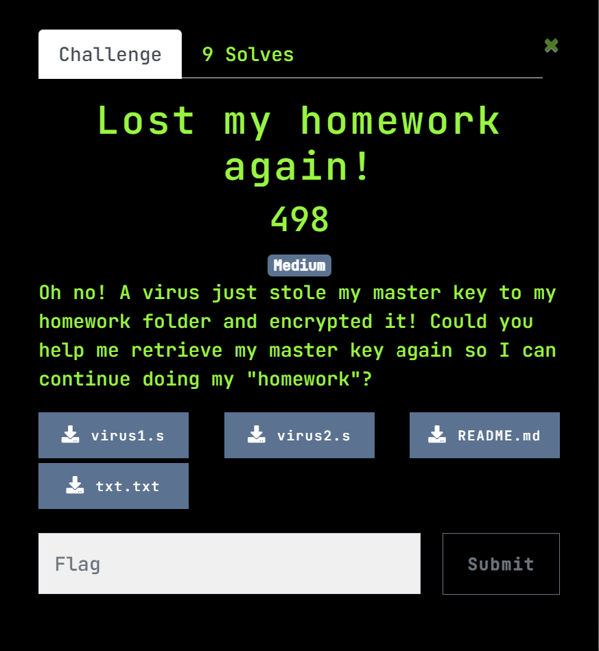
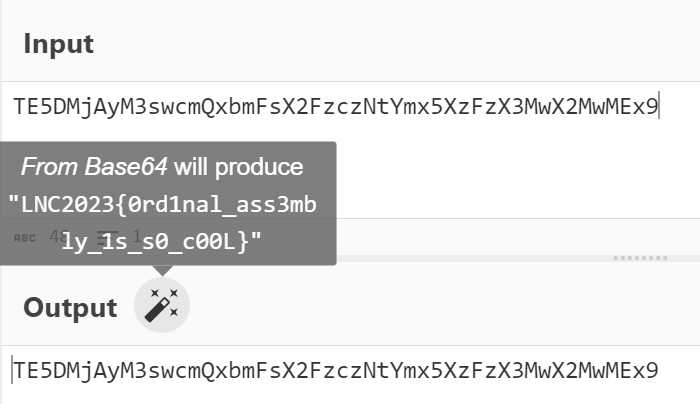

# RE/Lost My Homework Again!
### 498 pts, 9 solves, Medium difficulty

## Description



Attachements:<br/>
(don't worry there aren't any actual viruses... i think?)<br/>

[virus1.s](assets/virus1.s)<br/>
[virus2.s](assets/virus2.s)<br/>
[README.md](assets/README.md)<br/>
[txt.txt](assets/txt.txt)<br/>

## Starting out
Opening the README.md, we are told:
```
The virus has encrypted the master key using 2 programs:

virus1.s and virus2.s

For every character X,
X was passed into virus1.s which produces the first line of output in txt.txt
X was passed into virus2.s which produces the second line of output in txt.txt

Carl was too lazy to make the programs accept standard input, so line 6's MOV instruction is the "input".
Every number was "inputted" to the program by assigning it to the X0 register on line 6. Just change the #122 to some other number.

Carl was also too lazy to output anything, so the program actually outputs using its return status code.
Not that you should be running this program anyway.

Both outputs are required to reconstruct the original value. Good luck!
```
This tells us two things:<br/>

1. Both lines of the txt file were encrypted from the same plaintext
2. The 'virus' programs will encrypt the plaintext letter by letter

Now, let's take a look at the viruses:<br/>
<table>
<tr>
<th width = "50%">

[virus1:](assets/virus1.s)</th>
<th width = "50%">

[virus2:](assets/virus2.s)</th>
</tr>
<tr>

<td>

```assembly
.global _start
.align 2

_start:

    mov X0, #67             ; This number is substituted with the input

    ; factor 1
	mov X19, #20
    sub X0, X0, X19
    
    ; factor 2
    mov X19, #4
    udiv X20, X0, X19
    msub X21, X20, X19, X0
    add X0, X21, X20

    ; factor 3
    mov X19, #3
    mul X0, X0, X19

    ;; syscall to exit
	mov X16, #1
	svc #0x80
```
</td>
<td valign="top">

```assembly
.global _start
.align 2

_start:

    mov X0, #67             ; This number is substituted with the input

    ; factor 1
	mov X19, #20
    sub X0, X0, X19
    
    ; factor 2
    mov X19, #4
    udiv X20, X0, X19
    msub X21, X20, X19, X0
    
    mov X0, X21

    ;; syscall to exit
	mov X16, #1
	svc #0x80
```
</td>
</tr>
</table>
<br/>

Since we know that the 'virus' programs will encrypt the same plaintext letter by letter, let's see what the 'virus' does.

## Reading assembly code

Both 'viruses' are written in ARM64 assembly. <br/>
For those unfamiliar, here is a quick guide: [ARM64 cheatsheet](https://courses.cs.washington.edu/courses/cse469/19wi/arm64.pdf) <br/>
For the extra lazy, here's the python equivalent for relevant sections
<table>
<tr>
<th width = 25%>Assembly</th>
<th width = 50%>Explanation</th>
<th width = 25%>Python equivalent</th>
</tr>

<tr>
<td>

```Assembly
MOV Rd, #imm  
```
</td>
<td> moves a 16-bit immediate value to a register</td>
<td>

```py
Rd = imm
```
</td>
</tr>

<tr>
<td>

```Assembly
ADD(s) Rd, Rn, Rm
```
</td>
<td> adds a register value and an optionally-shifted register value, and writes the result to the destination register.</td>
<td>

```py
Rd = Rn + Rm
```
</td>
</tr>

<tr>
<td>

```Assembly
SUB(s) Rd, Rn, Rm
```
</td>
<td> subtracts an optionally-shifted register value from a register value, and writes the result to the destination register</td>
<td>

```py
Rd = Rn - Rm
```
</td>
</tr>

<tr>
<td>

```Assembly
(U/S)DIV Rd, Rn, Rm
```
</td>
<td> Unsigned/Signed Divide divides a signed integer register value by another signed integer register value, and writes the result to the destination register. The condition flags are not affected.</td>
<td>

```py
Rd = Rn // Rm
```
</td>
</tr>

<tr>
<td>

```Assembly
MSUB Rd, Rn, Rm, ra
```
</td>
<td> Multiply-Subtract multiplies two register values, subtracts the product from a third register value, and writes the
result to the destination register.</td>
<td>

```py
Rd = ra − Rn * Rm
```
</td>
</tr>
</table>

<br/>
Let's convert the Assembly to python so that it's easier to understand.
<table>
<tr>
<th width = "50%">virus1:</th>
<th width = "50%">virus2:</th>
</tr>
<tr>

<td>

```py
def v1(num):
	
    num -= 20
    remainder = num % 4
    quotient = num // 4
    num = remainder + quotient
    return num * 3
```
</td>
<td valign="top">

```py
def v2(num):

    num -= 20
    remainder = num % 4
    return remainder
```
</td>
</tr>
</table>
<br/>

> **Note**
>
> Performing:
> ```Assembly
> udiv X20, X0, X19
> msub X21, X20, X19, X0
> ```
> is effectively the same as
> ```py
> X20 = X0 // X19
> X21 = X0 % X21
> ```
> since
> ```py
> X0 - (X0 // X19 * X19) gives the remainder of X0 / X19
> ```

<br/>
The virus encrypts the text and outputs it to the [txt.txt](assets/txt.txt) file. <br/>

The [txt.txt](assets/txt.txt) files give the following:<br/>
Virus1 encryption:
`48 39 27 36 45 69 36 78 45 30 78 81 66 69 48 75 63 69 42 78 51 27 42 81 66 81 48 72 54 69 75 27 51 81 42 81 51 30 45 81 51 27 45 81 45 39 75 30`
<br/>

Virus2 encryption:
`0 1 1 0 1 2 1 1 1 3 3 3 3 1 1 0 2 1 2 3 0 2 2 2 3 2 2 0 1 1 0 1 0 2 2 2 0 3 1 3 0 2 1 3 1 1 0 1`
<br/><br/>
This gives us slight confidence that the python conversion was correct since all numbers from virus1 are divisible by 3. <br/>

To solve the challenge, we clearly need to reverse the program to get the original plaintext.

## Actual reversing/Exflitration
Reversing the program is rather simple. <br/>
Both viruses perform a similar function initially; Taking 20 off the initial number<br/>
After which, virus2 will return its remainder when divided by 4, <br/>
While virus1 sums the quotient and remainder and multiply it by 3. </br>
</br>

Recall that each value of the inital plaintext was passed through each function.

From this, we can deduce the steps to reversing it:
1. Divide virus1's output by 3
2. Obtain the quotient by subtracting virus2's output (the remainder)
3. multiply it by 4 and add the remainder
4. add 20 to get the original value<br/>

For the sake of the writeup, here's the mathematical proof: <br/>

$$ v1 = 3\bigg[\Big\lfloor{\frac{n-20}{4}}\Big\rfloor + \bmod\Big(\frac{n-20}{4}\Big)\bigg] $$

$$ v2 = \bigg\lfloor{\frac{n-20}{4}}\bigg\rfloor $$

$$ \frac{v1}{3} = \Big\lfloor{\frac{n-20}{4}}\Big\rfloor + \bmod\Big(\frac{n-20}{4}\Big) $$

$$ \therefore \frac{v1}{3} - v2 = \bmod\Big(\frac{n-20}{4}\Big) $$

$$ \therefore n - 20 = 4 \Big(\frac{v1}{3} - v2\Big) + \bigg\lfloor{\frac{n-20}{4}}\bigg\rfloor =  4\Big(\frac{v1}{3} - v2\Big) +v2 $$

$$ \Rightarrow n = 4\Big(\frac{v1}{3} - v2\Big) +v2 + 20 $$

<br/>

Here is a [sample solve script](assets/solve.py) written in python:
```py
v1_out = "48 39 27 36 45 69 36 78 45 30 78 81 66 69 48 75 63 69 42 78 51 27 42 81 66 81 48 72 54 69 75 27 51 81 42 81 51 30 45 81 51 27 45 81 45 39 75 30".split(" ")
v2_out = "0 1 1 0 1 2 1 1 1 3 3 3 3 1 1 0 2 1 2 3 0 2 2 2 3 2 2 0 1 1 0 1 0 2 2 2 0 3 1 3 0 2 1 3 1 1 0 1".split(" ")

v1_out = [int(i) for i in v1_out]
v2_out = [int(i) for i in v2_out]

def re(v1_out, v2_out):
    x = []

    for i in range(len(v1_out)):
        remainder = v2_out[i]
        quotient = v1_out[i] / 3 - remainder
        num = quotient * 4 + remainder + 20
        x.append(int(num))

    return x

key = re(v1_out, v2_out)
plaintext = "".join([chr(i) for i in key])
print(plaintext)
```

The output of virus1 gives us `TE5DMjAyM3swcmQxbmFsX2FzczNtYmx5XzFzX3MwX2MwMEx9`
<br/>
Wait a second.. that's not the flag?!

## Stare harder

Just as I do with challenges when I do not know where to start, I threw the output into cyberchef. <br/>
The magic button told me it was encoded in base64. <br/>


<br/> That's the flag
> LNC2023{0rd1nal_ass3mbly_1s_s0_c00L}