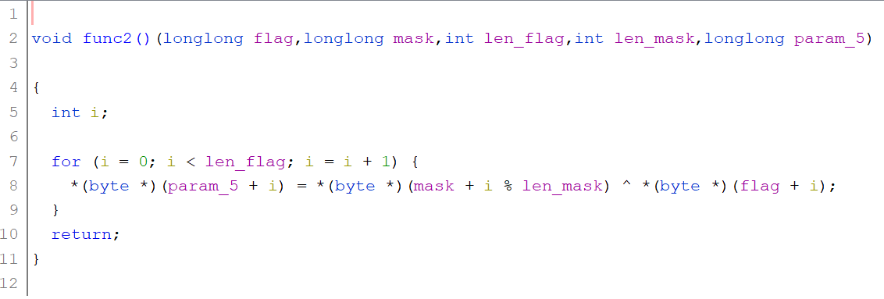

# RE/Time Travel
### 486 pts, 19 solves, Easy difficulty

## Description

Attachements:<br/>

[tt.exe](Assets/tt.exe)<br/>

## Initial look
As is with any other RE challenge, we first dump the file into Ghidra to decompile.

Hopping into main, we see:


> **Note**
>
> I've renamed a few variables throughout this writeup to make the code more readable

```c
curr_time = time((time_t *)0x0);
```

which gets the device's current time (in seconds), and

```c
if (curr_time < 112359) {
    func1(uVar1,uVar2,uVar3,in_R9, in_stack_ffffffffffffffe8);
}
```

which checks if the device's time is smaller than 112359. Following func1(), we can observe that it will print the flag.

## Plausible solutions

This gives us two possible ways to solve this challenge (I do not know if these work, I just think they do):

1. changing the system time to a value less than 112359, or
2. using gef/pwngdb to jump instructions to immediately execute func1()

I, however was unable to test either of these solution because my cygwin was not installed properly (and trying to fix it would take longer than reversing the program).

As such, let's follow through func1().

## Learning what the program does


func1() calls yet another function, func2().

func1() does not tell us much. However, it does reference the variables used which is extremely useful for helping us understand the program (fyi: you can double-click on the variable name to see the values of the variable in ghidra).

For now, let's look into func2() first.



For each character in the encoded flag, func2 xors it with the mask, and appends it to param_5 (which it returns as the decoded flag).

## Solving

Since param_5 is already the flag, we do not need to reverse anything. We can simply replicate what the program does to obtain the flag.

Here is a [sample solve script](Assets/solve.py):

```py
mask = "STRINGSCANTSOLVEEVERYTHING"
flag = [0x1f, 0x1a, 0x11, 0x7b, 0x7e, 0x75, 0x60, 0x38, 0x36, 0x7f, 0x61, 0x3b, 0x10, 0x3b, 0x65, 0x1a, 0x26, 0x66, 0x30, 0x1e, 0x3d, 0x0b, 0x3c, 0x3c, 0x3c, 0x29, 0x0c, 0x36, 0x66, 0x2a, 0x25, 0x18, 0x27, 0x72, 0x2c, 0x7d, 0x0b, 0x6a, 0x77, 0x74, 0x60, 0x72, 0x77, 0x2b, 0x00, 0x00, 0x00, 0x00, 0x00, 0x00, 0x00, 0x00, 0x00, 0x00, 0x00, 0x00, 0x00, 0x00, 0x00, 0x00, 0x00, 0x00, 0x00, 0x00]
mask_len = len(mask)
ans = []
for i in range(len(flag)):
    ans.append(ord(mask[i % mask_len]) ^ flag[i])

for i in ans:
    print(chr(i), end="")
```

> LNC2023{w15h_w3_c0uLd_turn_b4ck_t1m3_988672}