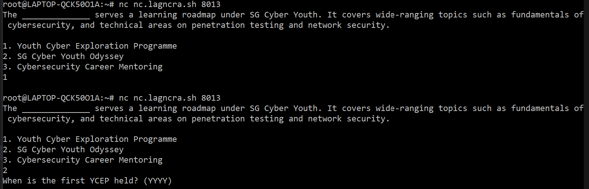

# Lag and Crash 3.0/Sponsor/CSA
### 100 pts, 24 solves, Too difficult to rate

## Description


## Foreword

This was honestly the hardest CTF question ever set. This impossible labyrinth that could trap even Theseus took me a gruelling month of constant trials and failure to finally escape.

## Question 1

After connectiong to `nc nc.lagncra.sh 8013`, we are greeted with the first challenge.

```
The ______________ serves a learning roadmap under SG Cyber Youth. It covers wide-ranging topics such as fundamentals of cybersecurity, and technical areas on penetration testing and network security.

1. Youth Cyber Exploration Programme
2. SG Cyber Youth Odyssey
3. Cybersecurity Career Mentoring
```

To tackle this, we first need to acknowledge that there are only 3 possible solutions, and that as it is only the first question, my will was still strong enough to conduct experimental testing. After years of non-stop trial-and-error, I finally obtained the solution, `2`.



We observe that inputting `1` leads to a dead-end after submitting it, but inputting `2` outputs the next question.

## Question 2

```
When is the first YCEP held? (YYYY)
```

This cryptic message left me dumbfounded for long. After trying all possible ciphers known to mankind, I was about to give up. Just then, I recalled a new technology and exploit, known as `input engineering`.

Thus, I opened up a search engine known as `Google` and entered in a complex combinations of tokens that comprised of the English lexicon. The following input was the culmination of 18 years of top-tier education and unspoken amounts of blood, sweat and tears.


Interpretting the millions of results came as another obstacle. After consulting friends and professors on what these foriegn texts meant, I finally understood.

The first result told us:

```
... (YCEP), held on 11-14 and 19-22 June at our Cyber Wargame Centre. YCEP is a 4-day programme specially designed to allow secondary school ...
```

Take note of the numbers used. `11`, `14`, `19`, `22` and `4`. From this, we can decude that the formula to the answer is $(11 × 14 + 19 × 22) × 4 - (22×11)-14(\frac{22}{11}) = 2018$

## Question 3

```
Which industry certification will CSDP Officer be required to obtain?

1. CEH & Cisco CyberOps Associate
2. OSCP & CEH
3. CompTIA A+ & CompTIA Se+
4. OSEP & CISSP
```

Finally, we are nearing the end. My suffering would end soon, even though I did not know it at that point in time. As such, instead of taking another lifetime to bruteforce by hand, I wrote a [script](assets/solve.py) to do it for me instead.

```py
from pwn import *

for i in range(1, 5):
    io = remote('nc.lagncra.sh', 8013)

    io.recvuntil(b'Mentoring')
    io.sendline(b"2")

    io.recvuntil(b'(YYYY)')
    io.sendline(b"2018")

    io.recvuntil(b'CISSP')
    io.sendline(bytes(str(i), 'ascii'))

    print(i, end = ": ")
    print(io.recvall(timeout=0.5))

    io.close()
```

following is the output:


## Flag

Taking a careful look at the output, we can finally rest as we have obtained the flag.

> LNC2023{i_l0v3_cSa}

<br/>
Writeup by Team RVCTF 0x45

```diff
# In all seriousness thanks to the authors for the fun challenges!
```